# Architecture Diagrams

Interactive diagrams of the Commentary Dashboard infrastructure.

> **Note:** These diagrams use Mermaid syntax and render in GitHub, VS Code (with Mermaid extension), and most modern documentation tools.

---

## 1. Overall System Architecture


---

## 2. Monorepo Structure


---

## 3. Cache System Architecture


---

## 4. Request Flow: Tournament Data

```mermaid
sequenceDiagram
    participant User as User Browser
    participant Frontend as React Frontend
    participant BFF as Express BFF
    participant Cache as FallbackCache
    participant Redis as RedisCache
    participant Memory as InMemoryCache
    participant StartGG as start.gg API

    User->>Frontend: Load Tournament URL
    Frontend->>BFF: GET /api/tournament/slug

    BFF->>Cache: get("tournament:slug")
    Cache->>Redis: get(key)

    alt Redis Hit
        Redis-->>Cache: return data
        Cache-->>BFF: return data (cached: true)
        BFF-->>Frontend: { data, cached: true, ttl: 120s }
        Frontend-->>User: Display Data ⚡ <100ms
    else Redis Miss/Error
        Redis--xCache: null or error
        Cache->>Memory: get(key)

        alt Memory Hit
            Memory-->>Cache: return data
            Cache-->>BFF: return data (cached: true)
            BFF-->>Frontend: { data, cached: true }
            Frontend-->>User: Display Data ⚡ <100ms
        else Memory Miss
            Memory-->>Cache: null
            Cache-->>BFF: null
            BFF->>StartGG: getTournamentBySlug(slug)
            StartGG->>StartGG: Queue Request<br/>(rate limiting)
            StartGG-->>BFF: Tournament Data
            BFF->>BFF: calculateDynamicTTL(data)

            par Write to Both Caches
                BFF->>Cache: set(key, data, ttl)
                Cache->>Redis: set(key, data, ttl)
                Cache->>Memory: set(key, data, ttl)
            end

            BFF-->>Frontend: { data, cached: false, ttl: 15s }
            Frontend-->>User: Display Data 🐌 50s+
        end
    end
```



---

## 5. Cache Fallback Flow


---

## 6. Write-Through Cache Strategy

```mermaid
flowchart TD
    Start([SET Request<br/>key, value, ttl]) --> Parallel{Write to All Caches<br/>Promise.all}

    Parallel -->|Parallel Write 1| WriteRedis[Redis.set<br/>key, value, ttl]
    Parallel -->|Parallel Write 2| WriteMemory[Memory.set<br/>key, value, ttl]

    WriteRedis --> RedisResult{Redis Result}
    WriteMemory --> MemoryResult{Memory Result}

    RedisResult -->|Success| RS[✓]
    RedisResult -->|Error| RE[✗ Log Error]

    MemoryResult -->|Success| MS[✓]
    MemoryResult -->|Error| ME[✗ Log Error]

    RS --> Collect{Check Results}
    RE --> Collect
    MS --> Collect
    ME --> Collect

    Collect -->|All Failed| Error[Throw Error:<br/>All caches failed]
    Collect -->|Some Failed| Warning[Log Warning:<br/>Partial success]
    Collect -->|All Success| Success[Return Success]

    Error --> End([End])
    Warning --> End
    Success --> End

    style Start fill:#F5F9FF,stroke:#1976D2,stroke-width:3px
    style Success fill:#F5FBF5,stroke:#388E3C,stroke-width:3px
    style Warning fill:#FFFAF0,stroke:#F57C00,stroke-width:3px
    style Error fill:#FFF5F5,stroke:#C62828,stroke-width:3px
    style End fill:#F5F9FF,stroke:#1976D2,stroke-width:3px
```



---

## 7. Dynamic TTL Calculation


---

## 8. Data Flow: Frontend → Backend → API


---

## 9. Cache Promotion Flow (Optional Feature)


---

## 10. Deployment Architecture


---

## 11. Error Handling Flow


---

## 12. Component Interaction Diagram


---

## Viewing These Diagrams

### In VS Code
1. Install the "Markdown Preview Mermaid Support" extension
2. Open this file and press `Cmd+Shift+V` (Mac) or `Ctrl+Shift+V` (Windows/Linux)

### In GitHub
These diagrams render automatically when viewing this file on GitHub.

### Online Mermaid Editor
Copy any diagram and paste into: https://mermaid.live/

### Generate PNG/SVG
Use the Mermaid CLI:
```bash
pnpm add -g @mermaid-js/mermaid-cli
mmdc -i ARCHITECTURE_DIAGRAMS.md -o diagrams.pdf
```

---

## Legend

**Color Scheme (Maximum Contrast)**

**Light Backgrounds** (near-white with colored borders):
- 🔵 **Very Light Blue** (#F5F9FF): User-facing, flow start/end - **Contrast: 19:1**
- 🟢 **Very Light Green** (#F5FBF5): Backend, success - **Contrast: 19.5:1**
- 🟠 **Very Light Orange** (#FFFAF0): Cache, warnings - **Contrast: 20:1**
- 🔴 **Very Light Red** (#FFF5F5): Errors, external APIs - **Contrast: 19.8:1**
- 🟣 **Very Light Purple** (#F9F5FF): State management - **Contrast: 19.5:1**

**Dark Backgrounds** (very dark with white text):
- ⚫ **Very Dark Gray** (#1A1A1A): Vercel - **Contrast: 16:1**
- 🟣 **Very Dark Purple** (#311B92, #4A148C): Railway, APIs - **Contrast: 12:1**
- 🔴 **Very Dark Red** (#B71C1C): Redis - **Contrast: 11:1**

**Visual Distinction:**
- 3px colored stroke borders keep boxes visually distinct
- Near-white fills ensure maximum text readability
- All ratios exceed WCAG AAA standards (7:1+)

---

## Related Documentation

- [IMPLEMENTATION_SUMMARY.md](./IMPLEMENTATION_SUMMARY.md) - Full implementation details
- [CACHE_REFACTORING.md](./CACHE_REFACTORING.md) - Cache system refactoring
- [packages/backend/src/cache/README.md](./packages/backend/src/cache/README.md) - Cache architecture
- [README.md](./README.md) - Getting started guide
